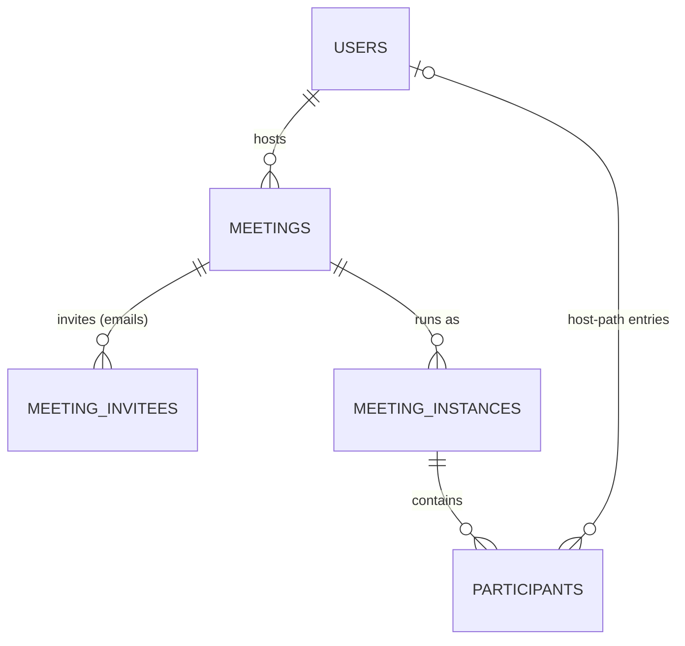
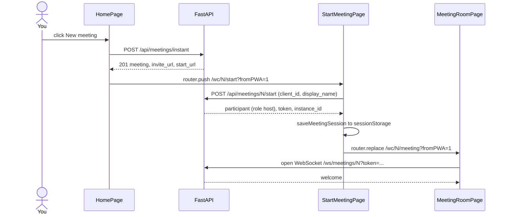
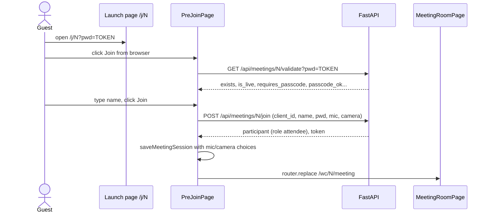
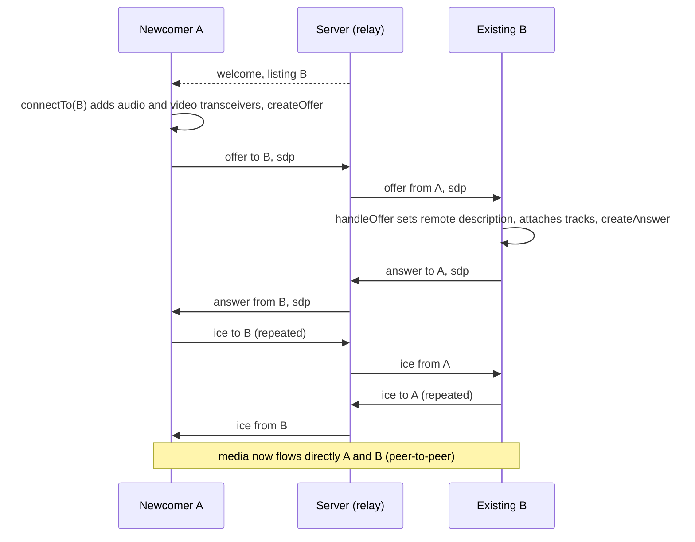

# Walkthrough: a beginner's guide to the Zoom Workplace clone

This guide is for someone new to the repo. You know basic JavaScript/React and a little Python,
but you have never used Next.js App Router, FastAPI, WebSockets or WebRTC. You will learn **where
things live** and **what happens when a user clicks something**, so you can make changes without
breaking anything.

> **The code is the source of truth.** Every path, function and hook named here exists on the
> `feat/zoom-clone` branch. If this guide and the code ever disagree, trust the code and fix
> the guide.

**Suggested reading order**

| When | Read |
|---|---|
| First hour | §1 What this is, §2 Run it, §3 Big picture |
| First day | §4 Frontend tour, §5 Backend tour |
| First week | §6 Follow the click (the core of the guide), §8 Testing |
| As needed | §7 Mobile, §9 Change checklists, §10 Gotchas and glossary, §11 Quick reference |

**Contents**

1. [What this app is](#1-what-this-app-is)
2. [Running it locally and debugging](#2-running-it-locally-and-debugging)
3. [The big picture](#3-the-big-picture)
4. [Frontend tour](#4-frontend-tour)
5. [Backend tour](#5-backend-tour)
6. [Follow the click](#6-follow-the-click)
7. [Responsive and mobile](#7-responsive-and-mobile)
8. [Testing](#8-testing)
9. [How to make common changes safely](#9-how-to-make-common-changes-safely)
10. [Conventions, gotchas and glossary](#10-conventions-gotchas-and-glossary)
11. [Where do I find…?](#11-where-do-i-find)

---

## 1. What this app is

This is a **pixel-faithful clone of the Zoom Workplace web app** (`app.zoom.us`), built for a
Scaler SDE assignment. It has a dashboard, instant meetings, joining by meeting ID or invite link,
scheduling, a Meetings tab, and a **real multi-party video meeting** with host controls (Mute All,
mute one person, remove someone, end the meeting for everyone). The UI copies Zoom's real
measurements, colours and icons. Zoom features outside the assignment (chat, reactions, screen
share, AI…) are drawn on screen but do nothing except show a "not available in this demo" toast.

### The 60-second folder tour

```
zoom-clone/
├── README.md              features, run commands, deployment (read it after this guide)
├── PRD.md                 the full product spec, 2,000+ lines (skim it; search it when needed)
├── walkthrough.md         this guide
├── render.yaml            how the backend is deployed on Render
├── scripts/gen-icons.mjs  turns docs/reference/icons/*.svg into React icon components
├── docs/
│   ├── TESTING.md              how tests are written and run
│   ├── requirements/           detailed per-area specs measured from real Zoom (+ 06-tokens.css)
│   └── reference/              Zoom's real icons (SVG/PNG) and zoom-tokens.json
├── frontend/              Next.js + React + TypeScript: the app the browser runs
│   └── src/
│       ├── app/           ROUTES ONLY: one tiny file per URL
│       ├── features/      the real UI, one folder per product area
│       └── shared/        reusable building blocks: UI kit, tokens, hooks, API client, media
└── backend/               FastAPI + SQLAlchemy + SQLite: the REST API and the WebSocket server
    ├── app/               core, models, schemas, repositories, services, routers, realtime, seed
    ├── tests/             pytest
    └── data/zoom.db       the SQLite database file (created on first start, git-ignored)
```

### Three ideas to keep in your head

1. **There is no login.** Every browser is the same seeded user, "Alex Morgan". Your *role* in a
   meeting comes from **how you entered**. *New meeting* or *Start* makes you the **host**.
   *Join* or an invite link makes you an **attendee**. Each browser gets a random `client_id`, a
   UUID stored in `localStorage`. The server uses it to tell browsers apart.
2. **"Static UI only".** Many controls look real but do nothing. Clicking them shows a toast. The scope is deliberately focused on assignment requirements.
3. **Measured values are sacred.** In `PRD.md`, values marked **[M]** were measured from real
   Zoom, and you must not change them. Values marked **[D]** are design decisions made for the
   clone.

---

## 2. Running it locally and debugging

You need **Node 20+** and **Python 3.12+**. Use two terminals. These commands match
[README.md](README.md).

```bash
# Terminal 1 — backend (http://localhost:8000). Creates and seeds backend/data/zoom.db on first start.
cd backend
python3 -m venv .venv
.venv/bin/pip install -r requirements-dev.txt
.venv/bin/uvicorn app.main:app --reload --port 8000
```

```bash
# Terminal 2 — frontend (http://localhost:3000)
cd frontend
cp .env.example .env.local      # points at http://localhost:8000
npm install
npm run dev
```

Open <http://localhost:3000>. It redirects to `/wc/home`, the Home dashboard.

| URL | What it is |
|---|---|
| <http://localhost:3000/wc/home> | the app |
| <http://localhost:8000/docs> | **interactive API docs** (Swagger UI, generated by FastAPI). You can call every endpoint from here. |
| <http://localhost:8000/api/health> | `{"ok": true}` means the backend is up |

**To try a real call**, start a meeting in one browser. Then join it from a **different browser or
a private window**, using the meeting ID or the invite link. Two tabs of the *same* browser share
one `client_id`, so the second tab takes over the first (see §6d).

No camera? Set `NEXT_PUBLIC_FAKE_MEDIA=1` in `frontend/.env.local` and restart `npm run dev`. You
get a synthetic camera (an animated canvas) and a microphone (a soft tone). The code is in
[`shared/media/fakeMedia.ts`](frontend/src/shared/media/fakeMedia.ts).

### Useful commands

| Command (run in…) | What it does |
|---|---|
| `.venv/bin/python -m app.seed --reset` (backend) | wipe the database and seed it again ("today's" meetings become fresh) |
| `.venv/bin/pytest` (backend) | run the backend tests (about 90, ~1 s) |
| `.venv/bin/ruff check .` (backend) | Python lint |
| `npm test` (frontend) | run the frontend unit tests (about 470 in 50 files, ~3 s) |
| `npm run lint && npx tsc --noEmit && npm run build` (frontend) | the frontend quality gates |
| `npm run gen:icons` (frontend) | regenerate icon components after adding an SVG |

### Where to look when something breaks

| Symptom | Where to look |
|---|---|
| A Python error, or a 500 response | **Terminal 1** (uvicorn). Unexpected exceptions are logged there. The client receives `{"error": {"code": "INTERNAL_ERROR", …}}`. |
| A request fails or returns odd data | Browser **DevTools → Network**. Click the request and read the JSON `error.code`. Then try the same call in `/docs`. |
| `CORS` error in the console | Your frontend port is not in the backend's `FRONTEND_ORIGIN` allow-list. The defaults are 3000 and 3100–3103 ([`core/config.py`](backend/app/core/config.py)). |
| Home shows "Alex Morgan" but no meetings | The backend is down or `NEXT_PUBLIC_API_URL` is wrong. `useCurrentUser` falls back to a hard-coded user when `/api/me` fails. |
| "Today's" seeded meetings are in the past | The local DB was seeded days ago. Run `python -m app.seed --reset`. |
| Room stuck, or no video from the other person | **DevTools → Network → WS** shows the WebSocket frames (`welcome`, `offer`, `answer`, `ice`…). `chrome://webrtc-internals` shows the peer connections. In dev, `window.__zcRoom` holds the room's `peers` and `client` objects for poking around. |
| Warnings like `[zoom-clone] webrtc: …` | The frontend [`logger`](frontend/src/shared/lib/logger.ts). `warn` only prints in development. |
| `no such column` after you added a model field | Tables are never altered automatically (§5.5). Reset the DB. |
| A test fails only on your machine around midnight | Run tests through `npm test`. Vitest pins `TZ=America/New_York` ([`vitest.config.mts`](frontend/vitest.config.mts)). |

---

## 3. The big picture

The app talks over **three channels**:

```
┌──────────────────────── Browser: Next.js app (frontend/src) ───────────────────────┐
│  React components ──► TanStack Query hooks (features/*/api) ──► shared/lib/api      │
│  Meeting room ──► RoomProvider ──► SignalingClient (WebSocket) + PeerManager        │
└──────────┬──────────────────────────────┬───────────────────────────┬───────────────┘
           │ ① REST: HTTP + JSON          │ ② WebSocket               │ ③ WebRTC media
           │ /api/*                       │ /ws/meetings/{number}     │ peer-to-peer
           ▼                              ▼    ?token=…               ▼ (STUN helps connect)
┌──────────────── FastAPI (backend/app) ────────────────┐   ┌──────────────────────────┐
│ routers ─► services ─► repositories ─► models (ORM)   │   │ the other participants'  │
│ realtime/ MeetingHub ─► RoomManager (in-memory dict)  │   │ browsers (audio + video) │
└──────────────────────────┬────────────────────────────┘   └──────────────────────────┘
                           ▼
                SQLite file backend/data/zoom.db
```

| Channel | Carries | Who serves it | Frontend side | Backend side |
|---|---|---|---|---|
| ① **REST** | meetings, schedule, join/start, users | FastAPI `/api/*` | [`shared/lib/api/`](frontend/src/shared/lib/api) | [`app/routers/`](backend/app/routers) |
| ② **WebSocket** | roster, mute state, host commands, and the *signalling* that sets up WebRTC | FastAPI `/ws/meetings/{number}` | [`meeting-room/realtime/signalingClient.ts`](frontend/src/features/meeting-room/realtime/signalingClient.ts) | [`app/realtime/`](backend/app/realtime) |
| ③ **WebRTC** | the actual audio/video | nobody: browsers talk directly ("mesh", up to 8 people) | [`meeting-room/realtime/peerManager.ts`](frontend/src/features/meeting-room/realtime/peerManager.ts) | — (the server never sees media) |

Remember this: **the server only introduces the browsers to each other**. Once WebRTC connects,
video flows browser-to-browser.

---

## 4. Frontend tour

Stack: **Next.js 16 (App Router) + React 19 + strict TypeScript**, CSS Modules, TanStack Query,
`date-fns`, `clsx`. The `@/` import prefix means `frontend/src/` (set in `tsconfig.json`).

> ⚠️ [`frontend/AGENTS.md`](frontend/AGENTS.md) warns that this Next.js version has breaking
> changes compared to older tutorials. One you will see everywhere: `params` and `searchParams`
> in page files are **Promises**, so you `await` them.

### 4.1 Next.js App Router in five definitions

- **Route**: a URL the app answers, such as `/wc/home`.
- **`page.tsx`**: the file that renders a route. The *folder path* under `src/app/` becomes the URL.
  `app/(workplace)/wc/home/page.tsx` serves `/wc/home`.
- **Dynamic segment `[number]`**: a folder name in square brackets matches any value.
  `app/wc/[number]/meeting/page.tsx` serves `/wc/81234567890/meeting` and receives
  `params.number`.
- **Route group `(name)`**: a folder in parentheses is **not** part of the URL. It only groups
  routes so they can share a **layout**. `(workplace)` routes get the Zoom Workplace shell, and
  `(portal)` routes get the zoom.us portal chrome.
- **`layout.tsx`**: wraps every page below it. The root [`app/layout.tsx`](frontend/src/app/layout.tsx)
  loads the global CSS and [`providers.tsx`](frontend/src/app/providers.tsx) (TanStack Query +
  toasts).

Two more terms. A **component** is a function that returns UI (JSX). A file starting with
`"use client"` is a **client component**: it runs in the browser and can use state, effects and
`window`. Almost every feature component is a client component. This app is effectively a
client-rendered single-page app (see [`next.config.ts`](frontend/next.config.ts)).

### 4.2 The real route list

| URL | Route file (under `frontend/src/app/`) | Renders |
|---|---|---|
| `/` | [`page.tsx`](frontend/src/app/page.tsx) | redirect to `/wc/home` |
| `/wc/home` | [`(workplace)/wc/home/page.tsx`](frontend/src/app/%28workplace%29/wc/home/page.tsx) | `HomePage` (features/home) |
| `/wc/join` | [`(workplace)/wc/join/page.tsx`](frontend/src/app/%28workplace%29/wc/join/page.tsx) | `JoinShortcutPage`: Home with the Join modal open |
| `/wc/join/{n}` | [`(workplace)/wc/join/[number]/page.tsx`](frontend/src/app/%28workplace%29/wc/join/[number]/page.tsx) | server redirect to `/wc/{n}/join`, keeping the query |
| `/wc/meetings` | [`(workplace)/wc/meetings/page.tsx`](frontend/src/app/%28workplace%29/wc/meetings/page.tsx) | `MeetingsTabPage` (features/meetings) |
| `/wc/team-chat`, `/wc/contacts` | [`(workplace)/wc/team-chat/page.tsx`](frontend/src/app/%28workplace%29/wc/team-chat/page.tsx), [`(workplace)/wc/contacts/page.tsx`](frontend/src/app/%28workplace%29/wc/contacts/page.tsx) | static placeholders (features/shell) |
| `/wc/{n}/join` | [`wc/[number]/join/page.tsx`](frontend/src/app/wc/[number]/join/page.tsx) | `PreJoinPage` (features/join) |
| `/wc/{n}/start` | [`wc/[number]/start/page.tsx`](frontend/src/app/wc/[number]/start/page.tsx) | `StartMeetingPage` (features/meeting-room) |
| `/wc/{n}/meeting` | [`wc/[number]/meeting/page.tsx`](frontend/src/app/wc/[number]/meeting/page.tsx) | `MeetingRoomPage` (features/meeting-room) |
| `/wc/{n}/left` | [`wc/[number]/left/page.tsx`](frontend/src/app/wc/[number]/left/page.tsx) | `LeftMeetingPage` ("You have left the meeting") |
| `/j/{n}?pwd=…` | [`j/[number]/page.tsx`](frontend/src/app/j/[number]/page.tsx) | `InviteLaunchPage`: the invite-link launch page |
| `/meeting/schedule` | [`(portal)/meeting/schedule/page.tsx`](frontend/src/app/%28portal%29/meeting/schedule/page.tsx) | `SchedulePage` (features/schedule) |
| `/meeting/{n}` | [`(portal)/meeting/[number]/page.tsx`](frontend/src/app/%28portal%29/meeting/[number]/page.tsx) | `MeetingDetailPage` (features/meetings) |
| `/meeting/{n}/edit` | [`(portal)/meeting/[number]/edit/page.tsx`](frontend/src/app/%28portal%29/meeting/[number]/edit/page.tsx) | `EditMeetingPage` (features/schedule) |

**Layouts (the "chrome" around pages)**

| Layout | Applies to | What it adds |
|---|---|---|
| [`(workplace)/layout.tsx`](frontend/src/app/%28workplace%29/layout.tsx) | `/wc/home`, `/wc/meetings`… | `WorkplaceShell`: 64px header, 80px left rail, white content card |
| [`(portal)/layout.tsx`](frontend/src/app/%28portal%29/layout.tsx) | `/meeting/*` | `PortalShell`: the zoom.us header and side menu |
| [`wc/[number]/layout.tsx`](frontend/src/app/wc/[number]/layout.tsx) | join/start/meeting/left | `RoomChromeGate` → `MeetingChromeGate`: shows the Workplace shell **only when the URL has `?fromPWA=1`** (Zoom's own flag), otherwise full viewport |

`fromPWA=1` matters. *New meeting* opens the room **inside** the shell. *Join from browser* on an
invite link opens it **full screen**. On phones the room is always full screen. The shell is
always rendered, and only its chrome is hidden, so crossing a breakpoint never remounts the
meeting (see [`MeetingChromeGate.tsx`](frontend/src/features/shell/components/MeetingChromeGate/MeetingChromeGate.tsx)).

### 4.3 Thin route files → feature components

Route files contain **no logic**. They read the URL and hand off to a feature. Here is a complete,
real example, [`wc/[number]/meeting/page.tsx`](frontend/src/app/wc/[number]/meeting/page.tsx):

```tsx
import { MeetingRoomPage } from "@/features/meeting-room";

export default async function Page({ params }: { params: Promise<{ number: string }> }) {
  const { number } = await params;
  return <MeetingRoomPage number={number} />;
}
```

If a page reads query parameters with `useSearchParams`, its route file wraps it in
`<Suspense>`, as [`(workplace)/wc/home/page.tsx`](frontend/src/app/%28workplace%29/wc/home/page.tsx)
does.

### 4.4 Anatomy of a feature folder

Each product area is a folder in [`frontend/src/features/`](frontend/src/features):

| Feature | What it owns |
|---|---|
| [`shell/`](frontend/src/features/shell) | Workplace header, left rail, phone bottom tab bar, profile menu, Settings/Search/About dialogs, Activity Center |
| [`portal/`](frontend/src/features/portal) | zoom.us portal header, side menu, footer |
| [`home/`](frontend/src/features/home) | clock, New meeting / Join / Schedule buttons, Join modal, calendar ("Upcoming meetings") widget, Recent meetings card |
| [`join/`](frontend/src/features/join) | invite launch page, pre-join page (camera preview + name form), waiting room, invalid-link page |
| [`meetings/`](frontend/src/features/meetings) | Meetings tab (Upcoming/Previous), meeting detail page, delete dialog |
| [`schedule/`](frontend/src/features/schedule) | Schedule and Edit forms, date picker, time zones |
| [`meeting-room/`](frontend/src/features/meeting-room) | the room: stage and tiles, toolbar, panels, dialogs, plus `realtime/` (WebSocket + WebRTC) |

Every feature has the same inner layout. Here is `home` as a real example:

```
features/home/
├── index.ts         PUBLIC SURFACE: exports HomePage, JoinShortcutPage. Others import only from here.
├── types.ts         TypeScript types used inside the feature
├── constants.ts     magic values with names (e.g. DAY_PARAM = the ?day= query key)
├── api/             TanStack Query hooks that talk to the backend
│   ├── useDayMeetings.ts          GET /api/meetings?view=day…  (calendar widget)
│   ├── useRecentMeetings.ts       GET /api/meetings?view=previous (Recent card)
│   └── useStartInstantMeeting.ts  POST /api/meetings/instant then navigate (New meeting)
├── hooks/           UI logic as custom hooks (no JSX): useSelectedDay, useJoinMeetingInput…
├── utils/           pure functions, easy to unit-test: joinInput.ts, eventCard.ts… (+ *.test.ts)
└── components/      React components, each with its own *.module.css
    ├── HomePage.tsx               composes everything below
    ├── actions/                   HomeActions, NewMeetingAction, ActionButton…
    ├── calendar/                  CalendarWidget, DayList, EventCard…
    ├── join-modal/                JoinMeetingModal, JoinMeetingDialog, MeetingHistoryDropdown…
    └── recent/, clock/, hub/, new-meeting/, day-picker/, download-cta/, common/
```

**The rule:** a feature may import anything from `shared/`. It may import another feature **only
through that feature's `index.ts`**. For example, home uses `meetingRefOf` and `startHref` from
`@/features/meetings`.

A **hook** is a function whose name starts with `use` and that can use React state and effects.
In this repo, **logic lives in hooks and components mostly render**. Look at
[`HomePage.tsx`](frontend/src/features/home/components/HomePage.tsx): it is nearly pure layout.

### 4.5 The shared layer (`frontend/src/shared/`)

| Folder | What's inside | Import as |
|---|---|---|
| [`styles/`](frontend/src/shared/styles) | `tokens.css` + `tokens/*.css` (design tokens), `globals.css` (reset, focus ring), `touch.module.css` (44px tap areas) | loaded once in `app/layout.tsx` |
| [`ui/`](frontend/src/shared/ui) | the hand-built UI kit: `Button`, `IconButton`, `Input`, `Select`, `Checkbox`, `Modal`, `Popover`, `Menu`, `Tooltip`, `Avatar`, `Toast`, `StaticButton`… | `import { Button } from "@/shared/ui"` |
| [`hooks/`](frontend/src/shared/hooks) | generic hooks: `useClickOutside`, `useEscapeKey`, `useClock`, `useClipboard`, `useMediaQuery` + `MEDIA`, `useLocalStorage`, `useFocusTrap`, `useElementSize`… | `import { useClock } from "@/shared/hooks"` |
| [`lib/api/`](frontend/src/shared/lib/api) | `apiFetch`, one function per endpoint, `queryKeys`, `useCurrentUser`, invitation helpers | `@/shared/lib/api` |
| [`lib/`](frontend/src/shared/lib) | `format.ts` (meeting numbers, times), `routes.ts` (URL builders), `identity.ts` (`getClientId`), `storage.ts`, `meetingSession.ts` (start/join → room hand-off), `env.ts`, `calendar.ts`, `logger.ts` | `@/shared/lib/format`… |
| [`media/`](frontend/src/shared/media) | camera/microphone: `acquireStream`, `useLocalPreviewStream`, `useMediaDevices`, level meter, `fakeMedia.ts`, `AudioLevelIcon` | `@/shared/media` |
| [`icons/`](frontend/src/shared/icons) | `generated/*Icon.tsx`: one component per Zoom SVG (**never edit by hand**) | `import { NavHomeIcon } from "@/shared/icons/generated/NavHomeIcon"` |
| [`types/`](frontend/src/shared/types) | `api.ts` mirrors the backend's Pydantic schemas 1:1 (snake_case). `realtime.ts` mirrors the WebSocket protocol. | `@/shared/types/api` |

The full props reference for every shared component and hook is in
[frontend/README.md → Shared layer](frontend/README.md).

**Design tokens.** A *design token* is a named design value (a colour, radius, shadow, z-index or
duration) stored as a **CSS custom property** (a CSS variable, such as `--zc-orange: #FF742E`).
Components use the name, never the raw value.

- [`tokens.css`](frontend/src/shared/styles/tokens.css) imports
  [`tokens/base.css`](frontend/src/shared/styles/tokens/base.css), which holds Zoom's real
  tokens copied verbatim plus a "semantic" layer such as `--color-text-primary` and
  `--radius-8`. Then it imports one file per area: `shell.css`, `portal.css`, `home.css`,
  `join.css`, `meetings.css`, `schedule.css`, `room.css`.
- A real chain, traced from the orange *New meeting* button:

  ```
  HomeActions.module.css   .orange { background-color: var(--home-action-new-bg); }
  tokens/home.css          --home-action-new-bg: var(--zc-orange);
  tokens/base.css          --zc-orange: #FF742E;
  ```

**Icons.** [`scripts/gen-icons.mjs`](scripts/gen-icons.mjs) reads every
`docs/reference/icons/*.svg` and writes `shared/icons/generated/<PascalName>Icon.tsx`
(`nav-home.svg` → `NavHomeIcon`). It also copies PNGs to `frontend/public/zoom/`. Single-colour
icons use `currentColor`, so you colour them with CSS `color`.

### 4.6 Styling rules

A **CSS Module** is a `.module.css` file next to a component. Its class names are scoped to that
component automatically, so `.button` in one file never clashes with `.button` in another. You use
it like this:

```tsx
import styles from "./HomeActions.module.css";
<div className={styles.row}>…</div>
```

| Do | Don't |
|---|---|
| One `Foo.module.css` per `Foo.tsx` | Tailwind, CSS-in-JS, global classes |
| `var(--some-token)` for every colour, radius, shadow, z-index, duration | raw `#hex`, `rgba(…)` or `box-shadow: 0 2px…` in component CSS |
| Add a missing token to the right `tokens/*.css` file | inline `style={{…}}`, except for truly computed values (a tile size) |
| `clsx(styles.a, cond && styles.b)` to combine classes | string concatenation of class names |
| Define `@keyframes` inside the module that uses them | rely on global keyframes |
| Prefer container queries for page layouts inside the shell card | assume the card is `100vw` wide (the Activity Center can shrink it) |

### 4.7 How data fetching works (TanStack Query)

An **API** is the set of URLs the backend exposes. An **endpoint** is one of them, such as
`GET /api/meetings`. **TanStack Query** is a library that calls endpoints, **caches** the answers
under a **query key** (an array like `["meetings", "day", "2026-10-08", "Asia/Kolkata"]`), and
re-renders components when data arrives. It has two hook shapes:

- `useQuery`: **read** data (GET). It returns `{ data, isPending, isError, refetch }`.
- `useMutation`: **change** data (POST/PATCH/DELETE). In `onSuccess` you **invalidate** related
  query keys, so the lists refetch.

The layers, using the Home calendar as a real example:

```
CalendarWidget.tsx                   component: const query = useDayMeetings(day)
  └─ features/home/api/useDayMeetings.ts   useQuery({ queryKey: queryKeys.meetings.day(date, tz),
                                                       queryFn: () => listDayMeetings(date, tz) })
       └─ shared/lib/api/meetings.ts       listDayMeetings → apiFetch("/meetings", { query: { view: "day", … } })
            └─ shared/lib/api/client.ts    fetch(`${NEXT_PUBLIC_API_URL}/api/meetings?view=day…`)
                                           throws ApiError { status, code, message } on failure
```

Key files:

- [`shared/lib/api/client.ts`](frontend/src/shared/lib/api/client.ts): `apiFetch`, `ApiError`,
  and `isApiError(error, "MEETING_FULL")`.
- [`shared/lib/api/queryKeys.ts`](frontend/src/shared/lib/api/queryKeys.ts): every key in one
  place. **After any meeting change, invalidate `queryKeys.meetings.all`** (it is a prefix of
  every meeting key).
- [`shared/lib/queryClient.ts`](frontend/src/shared/lib/queryClient.ts): defaults. Data counts
  as fresh for 30 s, there is no refetch on window focus, and 4xx errors are never retried.

### 4.8 State in the meeting room

The room is the most complex part of the app. Its state is split in two:

```
MeetingRoomPage
└─ RoomProvider  (realtime/RoomProvider.tsx) ── React Context = "the meeting"
   │   useRoomMedia        local mic + camera tracks, mute/video on, devices
   │   useRoomConnection   WebSocket + PeerManager + useReducer(roomReducer)
   │   useActiveSpeaker    who is talking
   │   useRoomToasts       room notifications
   └─ RoomUiProvider (state/RoomUiProvider.tsx) ── React Context = "what's open on screen"
       │   useReducer(roomUiReducer): panels, menus, dialogs, leave bar, promoted button…
       └─ MeetingRoom → Stage, Toolbar, RightPanels, dialogs…
```

| State | Lives in | Changed by | Read with |
|---|---|---|---|
| Server truth: phase, participants, host, settings, remote streams | [`realtime/roomReducer.ts`](frontend/src/features/meeting-room/realtime/roomReducer.ts) | WebSocket messages, via [`messageHandler.ts`](frontend/src/features/meeting-room/realtime/messageHandler.ts) | `useMeetingRoom()`, `useParticipants()` |
| My mic/camera | [`realtime/useRoomMedia.ts`](frontend/src/features/meeting-room/realtime/useRoomMedia.ts) | toolbar clicks, host `force_mute` | `useLocalControls()` |
| Host actions | — | — | `useHostControls()` → `muteAll`, `mute`, `remove` |
| Local UI (open panel/menu/dialog) | [`state/roomUiReducer.ts`](frontend/src/features/meeting-room/state/roomUiReducer.ts) | `useRoomUi()` actions (`togglePanel`, `openDialog`…) | `useRoomUi()` |

A **reducer** is a pure function `(state, action) → newState`. Because it is pure, both reducers
have thorough unit tests (`roomReducer.test.ts`, `roomUiReducer.test.ts`). The `phase` moves
through `connecting → live → (reconnecting) → ended | removed | duplicate | left | failed`.
Once a phase is terminal it never changes again.

---

## 5. Backend tour

Stack: **FastAPI** (web framework) + **Pydantic v2** (data validation) + **SQLAlchemy 2** (ORM) +
**SQLite** (a database stored in one file) + **Uvicorn** (the server process).

### 5.1 The layers and a request's lifecycle

```
HTTP request
  │
  ▼  routers/        thin handlers: parse input, call ONE service function, return a schema
  ▼  services/       business rules: "can't delete a live meeting", host transfer, IDs…
  ▼  repositories/   database queries only (SELECT … WHERE …), no rules
  ▼  models/         ORM classes = tables (one file per table)
  ▼  SQLite          backend/data/zoom.db
  ▲
  └─ services/presenters.py converts ORM objects → schemas/ (Pydantic response models) → JSON
```

| Term | Meaning here | Folder |
|---|---|---|
| **ORM** (Object-Relational Mapper) | write Python classes and objects instead of SQL. SQLAlchemy turns `Meeting(topic="x")` into an `INSERT`. | [`app/models/`](backend/app/models) |
| **Schema** (Pydantic model) | the exact JSON shape of a request or response, validated automatically. Bad input becomes a 422 error. | [`app/schemas/`](backend/app/schemas) |
| **Repository** | small functions that run queries (`find_owner`, `list_scheduled`) | [`app/repositories/`](backend/app/repositories) |
| **Service** | the rules of the product | [`app/services/`](backend/app/services) |
| **Router** | maps a URL and method to a function | [`app/routers/`](backend/app/routers) |
| **Dependency** | FastAPI's way to hand a function what it needs. `db: DbSession` gives one DB session per request, and `user: CurrentUser` gives the seeded user. | [`core/db.py`](backend/app/core/db.py), [`routers/dependencies.py`](backend/app/routers/dependencies.py) |

[`app/main.py`](backend/app/main.py) is the **app factory** (`create_app`). It builds the DB
engine, the token signer and the in-memory `RoomManager`. It stores them on `app.state`, adds
CORS and the error handlers, and registers the routers. On startup (`lifespan`) it creates the
tables, seeds the data, ends any meeting that was "live" before a restart, and starts the
**janitor** (a background cleanup loop).

### 5.2 One endpoint, traced line by line: `POST /api/meetings/instant`

This is what the *New meeting* button calls.

1. **Router.** [`routers/meetings.py`](backend/app/routers/meetings.py) → `create_instant(db, settings, user, body)`.
   FastAPI fills in `db` (a session), `settings` (from `app.state`) and `user`. The `CurrentUser`
   dependency calls `services/users.current_user`, which loads user id 1. `body` is validated
   against `InstantMeetingRequest` (`{use_pmi?: bool}`).
2. **Service.** [`services/meetings.py`](backend/app/services/meetings.py) → `create_instant(db, host, use_pmi, now)`:
   - If `use_pmi` is true, it reuses the user's Personal Meeting ID row (`get_pmi`).
   - Otherwise it builds `Meeting(type=INSTANT, topic="Alex Morgan's Zoom Meeting", …)` with:
     - `_new_meeting_number(db)`: [`id_generator.meeting_number`](backend/app/services/id_generator.py)
       makes 11 digits starting with 8 or 9, and `id_generator.unique` retries if
       `meetings_repo.number_taken` says the number already exists.
     - `id_generator.passcode()`: 6 characters, without ambiguous ones like `0OoIl1`.
     - `_new_invite_token(db)`: 32 URL-safe characters. This becomes the `?pwd=` of the invite link.
   - `db.add(meeting)` and `db.flush()` assign the row an `id` without committing yet.
3. **Instance.** [`services/instances.py`](backend/app/services/instances.py) → `ensure_live` reuses
   the live instance of that number, or calls `open_instance` to insert a `meeting_instances` row
   (`uuid`, `started_at=now`, `ended_at=NULL`).
4. **Commit.** Back in the service, `db.commit()` writes both rows in one transaction.
5. **Present.** The router calls `presenters.meeting(...)`, which turns the ORM object into the
   `Meeting` schema. It also calls [`services/invitation.py`](backend/app/services/invitation.py)
   for `invite_url` = `{APP_URL}/j/{number}?pwd={invite_token}` and `start_url`.
6. **Respond.** FastAPI serialises `InstantMeetingResponse` and returns **201** with JSON
   `{meeting, invite_url, start_url}`.

### 5.3 The database schema



| Table | One row is… | Notable columns and rules | Model |
|---|---|---|---|
| `users` | an account. Id 1 is "Alex Morgan" and the rest are contacts. | `email` and `pmi` (10 digits) are unique | [`user.py`](backend/app/models/user.py) |
| `meetings` | a meeting **definition**: instant, scheduled or the PMI | `meeting_number`, `type`, `topic`, `start_time` (UTC), `timezone`, `passcode`, `invite_token`, option flags, `deleted_at` (**soft delete**: the row is kept and marked deleted) | [`meeting.py`](backend/app/models/meeting.py) |
| `meeting_invitees` | an email invited to a scheduled meeting (stored only, never sent) | `UNIQUE(meeting_id, email)` | [`meeting_invitee.py`](backend/app/models/meeting_invitee.py) |
| `meeting_instances` | one actual **occurrence** of a meeting | `ended_at IS NULL` means **live**. A partial unique index allows **at most one live instance per meeting**. It also holds Mute All settings (`allow_unmute`, `mute_on_entry`). | [`meeting_instance.py`](backend/app/models/meeting_instance.py) |
| `participants` | one browser's entry into an instance | `client_id`, `role` host/attendee, `status` in_meeting/left/removed, `audio_muted`, `video_on`, `joined_at`, `left_at`. `user_id` is NULL for guests. | [`participant.py`](backend/app/models/participant.py) |

Storage conventions are in [`models/base.py`](backend/app/models/base.py). Timestamps are stored
as UTC ISO-8601 **text** (`2026-10-08T05:30:00.000Z`) and booleans as **0/1 integers**. Every
connection runs `PRAGMA foreign_keys = ON` ([`core/db.py`](backend/app/core/db.py)).

**Why both `meetings` and `meeting_instances`?** A *definition* can run many times. Your PMI
("Personal Meeting Room") is one `meetings` row that you may start every day. Each start creates
a new `meeting_instances` row with its own participants and duration. That is how **Recent
meetings** and **Meetings → Previous** work: they list *ended instances*, not definitions. "Is
this meeting live?" just means "does it have an instance with `ended_at IS NULL`?". This is
never stored as a flag, so it can never go out of sync.

**Number resolution.** A scheduled meeting can be created with "Use my PMI" (`uses_pmi = 1`). It
then shares the PMI's number. So `GET /api/meetings/{number}` normally means "the owner row"
(`uses_pmi = 0`), and `?id=` picks a specific calendar entry. On the frontend,
[`meetingRefOf`](frontend/src/features/meetings/utils/meetingRef.ts) builds that `{number, id?}`
reference for you.

### 5.4 Tables without migrations, and seed data

A **migration** is a versioned script that changes an existing database schema (for example,
"add column X"). **This project has none.** At startup,
[`seed.py`](backend/app/seed.py) → `prepare_database` calls `Base.metadata.create_all(engine)`.
That **creates missing tables but never alters existing ones**. If you add a column, reset the DB:
`python -m app.seed --reset`, or delete `backend/data/zoom.db`.

Seeding is controlled by `SEED_ON_START`:

| Value | Behaviour |
|---|---|
| `if-empty` (local default) | seed only if there are no users |
| `reset` (production on Render) | drop everything and re-seed on every boot, so "today" is always fresh |
| `off` | create tables only (the tests use this) |

The data itself is in [`seed_data.py`](backend/app/seed_data.py): 5 contacts, 7 upcoming scheduled
meetings (today to +9 days, relative to "now" in `Asia/Kolkata`), and 6 ended meetings with 2–6
participants each, for Recent and Previous.

### 5.5 Error format

Every failure has the same JSON shape (an "error envelope"):

```json
{ "error": { "code": "MEETING_NOT_FOUND", "message": "This meeting does not exist." } }
```

- [`core/errors.py`](backend/app/core/errors.py): the `AppError(status, code, message)`
  exception, plus handlers that convert `AppError`, Pydantic validation errors
  (→ `422 VALIDATION_ERROR`), HTTP errors and unexpected crashes (→ `500 INTERNAL_ERROR`) into
  the envelope.
- [`services/errors.py`](backend/app/services/errors.py): the catalogue of every domain error,
  such as `meeting_not_found()`, `meeting_live()` (409), `wrong_passcode()` (403),
  `meeting_full()` (409), `not_host()` (403) and `start_in_past()` (422). Services do
  `raise errors.meeting_live()`.
- Frontend: `apiFetch` turns the envelope into `ApiError { status, code, message }`. You check it
  with `isApiError(error, "WRONG_PASSCODE")`.

### 5.6 Configuration (environment variables)

These are read once into the frozen `Settings` dataclass in [`core/config.py`](backend/app/core/config.py).

| Backend env | Default | Purpose |
|---|---|---|
| `DATABASE_URL` | `sqlite:///backend/data/zoom.db` | where the DB lives |
| `FRONTEND_ORIGIN` | `http://localhost:3000` + 3100–3103 | CORS allow-list (comma-separated) |
| `APP_URL` | `http://localhost:3000` | frontend origin used to build invite links |
| `SECRET_KEY` | a dev value | signs participant tokens. **Set it in production.** |
| `SEED_ON_START` | `if-empty` | see §5.4 |
| `SEED_USER_NAME`, `SEED_USER_EMAIL` | Alex Morgan, alex.morgan@example.com | the default user |

Fixed settings (in code): at most **8** participants, 12-hour tokens, a 45 s heartbeat timeout,
a 60 s grace period to connect, 30 s before an empty room is ended, and a limit of 20 WS
messages per second (bursts up to 100).

| Frontend env (`frontend/.env.local`) | Purpose |
|---|---|
| `NEXT_PUBLIC_API_URL` | backend origin (the client adds `/api`) |
| `NEXT_PUBLIC_WS_URL` | WebSocket origin (`ws://…` locally, `wss://…` in production) |
| `NEXT_PUBLIC_APP_URL` | public origin used for invite links |
| `NEXT_PUBLIC_PLAN` | `pro` (default) or `basic` (makes Schedule imitate the 40-minute plan) |
| `NEXT_PUBLIC_TURN_URL/USERNAME/CREDENTIAL` | optional TURN server |
| `NEXT_PUBLIC_FAKE_MEDIA` | `1` = synthetic camera and microphone |

`NEXT_PUBLIC_*` values are **baked in at build time**, so restart `npm run dev` after changing
them. They are read in [`shared/lib/env.ts`](frontend/src/shared/lib/env.ts).

### 5.7 The `realtime/` package (WebSocket server)

| File | Job |
|---|---|
| [`routers/ws.py`](backend/app/routers/ws.py) | the `/ws/meetings/{number}?token=` endpoint. It hands the socket to the hub. |
| [`realtime/hub.py`](backend/app/realtime/hub.py) | `MeetingHub`: a socket's whole life. It admits (checks the token), sends `welcome`, runs the receive loop, and records the departure (with host transfer). |
| [`realtime/room_manager.py`](backend/app/realtime/room_manager.py) | `RoomManager`: in-memory `instance_id → {participant_id: Connection}`. Provides `broadcast`, `send_to` and `close_room`. |
| [`realtime/handlers.py`](backend/app/realtime/handlers.py) | `MessageHandlers`: relays offer/answer/ice, handles `media_state`, runs host commands |
| [`realtime/protocol.py`](backend/app/realtime/protocol.py) | every message as a Pydantic model. Bad input gets `error BAD_MESSAGE`. |
| [`realtime/welcome.py`](backend/app/realtime/welcome.py) | builds the first message a newcomer receives |
| [`realtime/connection.py`](backend/app/realtime/connection.py) | one socket plus its rate limiter (`TokenBucket`) |
| [`realtime/janitor.py`](backend/app/realtime/janitor.py) | every 15 s: marks never-connected participants as `left` and ends empty instances |
| [`services/participants.py`](backend/app/services/participants.py) | the in-meeting rules: `authenticate`, `depart`, `_transfer_host`, `set_media_state`, `mute_all`, `mute`, `remove` |

The room registry lives **in memory**. That means there is exactly **one backend process**, and a
restart drops every call (live instances are ended at startup).

---

## 6. Follow the click

Each walkthrough lists the steps in order, with the file and function that runs at each step.
Open the files side by side as you read.

### 6a. Clicking "New meeting" until you are in the room



| # | What happens | Where |
|---|---|---|
| 1 | Home renders the orange button | [`HomePage`](frontend/src/features/home/components/HomePage.tsx) → [`HomeActions`](frontend/src/features/home/components/actions/HomeActions.tsx) → [`NewMeetingAction`](frontend/src/features/home/components/actions/NewMeetingAction.tsx). The buttons are disabled while this browser is already in a meeting (`useShellContext().inMeeting`). |
| 2 | Click → `start(usePmi)`. `usePmi` is the "Use my PMI" checkbox from the chevron popover, remembered in `localStorage` (`zc.use_pmi`). | `NewMeetingAction` → [`useStartInstantMeeting`](frontend/src/features/home/api/useStartInstantMeeting.ts) |
| 3 | `useMutation` calls `createInstantMeeting({use_pmi})` → `POST /api/meetings/instant` | [`shared/lib/api/meetings.ts`](frontend/src/shared/lib/api/meetings.ts) |
| 4 | The backend creates the meeting and a live instance | §5.2 |
| 5 | `onSuccess`: invalidate `queryKeys.meetings.all` (the Home calendar now shows the live meeting), then `router.push(routes.start(number, { fromPWA: true }))` | [`routes.ts`](frontend/src/shared/lib/routes.ts) |
| 6 | `/wc/{n}/start` renders [`StartMeetingPage`](frontend/src/features/meeting-room/components/StartMeetingPage.tsx) (a dark frame with a spinner) | route [`wc/[number]/start/page.tsx`](frontend/src/app/wc/[number]/start/page.tsx) |
| 7 | [`useStartMeeting`](frontend/src/features/meeting-room/hooks/useStartMeeting.ts) waits for the user's name (`useCurrentUser`), then calls `startMeeting(number, { client_id: getClientId(), display_name })`. An `inFlight` map ensures React StrictMode's double-run sends **one** request. | [`identity.ts`](frontend/src/shared/lib/identity.ts) (`zc.client_id`) |
| 8 | Backend `POST /api/meetings/{n}/start` → [`services/entry.py`](backend/app/services/entry.py) `start()`: `meetings.resolve`, `instances.ensure_live` (reuses the instance), `_admissible_others` (checks for REMOVED and MEETING_FULL), role = **host** unless another browser already hosts, `_admit` → inserts a `participants` row and issues a **token** | [`routers/entry.py`](backend/app/routers/entry.py), [`core/security.py`](backend/app/core/security.py) |
| 9 | `saveMeetingSession(number, session, { audioMuted: true, videoOn: false })` writes the **hand-off** to `sessionStorage["zc.session.{n}"]`, then `router.replace(routes.room(...))` | [`meetingSession.ts`](frontend/src/shared/lib/meetingSession.ts) |
| 10 | `/wc/{n}/meeting` → [`MeetingRoomPage`](frontend/src/features/meeting-room/components/MeetingRoomPage.tsx). [`useRoomSession`](frontend/src/features/meeting-room/hooks/useRoomSession.ts) reads the hand-off. **If there is none, it redirects to the pre-join page.** | — |
| 11 | `RoomProvider` + `RoomUiProvider` + `MeetingRoom` mount. Then the mic and camera open, the WebSocket connects, `welcome` arrives, the phase becomes `live`, and you see the toast "You are host now." | §6d |

The **token** is the string `participant_id:instance_id` signed with `SECRET_KEY` (using
`itsdangerous`). It proves "I am participant 42 of instance 7" on the WebSocket and on
`POST /end`, without any login. The **hand-off** exists because the start/join call happens on
one page and the room is another page. `sessionStorage` is per-tab, so refreshing the room tab
reconnects with the same token.

### 6b. Joining from an invite link



| # | What happens | Where |
|---|---|---|
| 1 | The link looks like `{APP_URL}/j/{number}?pwd={invite_token}`. People copy it from the room's info popover or Invite window, or from Meetings → Copy Invitation. | backend [`services/invitation.py`](backend/app/services/invitation.py) `invite_url` |
| 2 | `/j/{n}` is a server component. It awaits `params` and `searchParams`, then renders `InviteLaunchPage`. A number that isn't 9–11 digits shows Zoom's error page instead. | [`j/[number]/page.tsx`](frontend/src/app/j/[number]/page.tsx) → [`InviteLaunchPage`](frontend/src/features/join/components/LaunchPage/InviteLaunchPage.tsx) |
| 3 | Two links. **Join from Zoom Workplace app** → `routes.preJoin(n, { pwd, fromPWA: true })` (inside the shell). **Join from browser** → `routes.preJoin(n, { pwd })` (full viewport). | [`LaunchView`](frontend/src/features/join/components/LaunchPage/LaunchView.tsx) |
| 4 | `/wc/{n}/join` → [`PreJoinPage`](frontend/src/features/join/components/PreJoinPage.tsx). [`usePreJoinParams`](frontend/src/features/join/hooks/usePreJoinParams.ts) reads `pwd` and `fromPWA`. | — |
| 5 | [`useMeetingValidation`](frontend/src/features/join/api/useMeetingValidation.ts) → `GET /api/meetings/{n}/validate?pwd=`. The backend `entry.validate` **never returns 404**: an unknown number gives `exists: false`. `passcode_ok` is true when `pwd` matches an invite token, and the passcode itself is never revealed. While waiting for the host, the page polls every 5 s. | [`services/entry.py`](backend/app/services/entry.py) `validate` |
| 6 | [`getPreJoinStage`](frontend/src/features/join/utils/preJoinStage.ts) picks `loading` / `invalid` / `unreachable` / `form`, and [`PreJoinStageContent`](frontend/src/features/join/components/PreJoinStageContent.tsx) renders the matching screen | — |
| 7 | [`PreJoinScreen`](frontend/src/features/join/components/PreJoinScreen.tsx) shows [`PreviewCard`](frontend/src/features/join/components/PreviewCard/PreviewCard.tsx) (a live camera preview from [`usePreviewMedia`](frontend/src/features/join/hooks/usePreviewMedia.ts)) and [`MeetingInfoForm`](frontend/src/features/join/components/MeetingInfoForm/MeetingInfoForm.tsx) (name, passcode only if `needsPasscode`, "Remember my name") | — |
| 8 | Join → [`usePreJoinEntry`](frontend/src/features/join/hooks/usePreJoinEntry.ts) `join()` → `POST /api/meetings/{n}/join` with `{client_id, display_name, pwd, passcode, audio_muted, video_on}` | [`sessions.ts`](frontend/src/shared/lib/api/sessions.ts) `joinMeeting` |
| 9 | Backend `entry.join`: `resolve_for_entry` (the row with the live instance, else the owner). Then it checks the passcode or pwd (`WRONG_PASSCODE`). If the meeting isn't live: `MEETING_NOT_STARTED` unless `join_before_host`, in which case it opens a host-less instance. Role is always **attendee**, and `user_id = NULL` marks a guest. | [`services/entry.py`](backend/app/services/entry.py) `join` |
| 10 | Success: remember the name, add a join-history entry (`zc.join_history`), `saveMeetingSession(number, session, preferences)` with the chosen mic/camera/speaker, then `router.replace(routes.room(...))` | [`rememberedName.ts`](frontend/src/features/join/utils/rememberedName.ts), [`joinHistory.ts`](frontend/src/shared/lib/joinHistory.ts) |
| 11 | Failure: [`toJoinFailure`](frontend/src/features/join/utils/joinErrors.ts) maps the error code to a form error ("Incorrect Password", "This meeting is full."…). `MEETING_NOT_STARTED` shows the [`WaitingRoom`](frontend/src/features/join/components/WaitingRoom/WaitingRoom.tsx), which re-sends Join automatically once validate reports the meeting live. | — |
| 12 | The room loads exactly as in §6a steps 10–11 | — |

**Other ways in.** The Home **Join** button opens
[`JoinMeetingDialog`](frontend/src/features/home/components/join-modal/JoinMeetingDialog.tsx).
[`useJoinMeetingInput`](frontend/src/features/home/hooks/useJoinMeetingInput.ts) formats the ID
as you type and understands a pasted invite URL. Submitting goes to
`routes.preJoin(id, { pwd, fromPWA: true })`. `/wc/join/{n}` is a server redirect to the same
page.

### 6c. Scheduling a meeting until it shows in Upcoming

| # | What happens | Where |
|---|---|---|
| 1 | Home **Schedule** → `router.push(routes.schedule())` → `/meeting/schedule`. That is a `(portal)` route, so it renders inside `PortalShell`. | [`HomeActions`](frontend/src/features/home/components/actions/HomeActions.tsx), [`(portal)/layout.tsx`](frontend/src/app/%28portal%29/layout.tsx) |
| 2 | [`SchedulePage`](frontend/src/features/schedule/components/SchedulePage.tsx) waits for hydration (`useIsClient`) because the defaults depend on the browser clock. Then [`NewMeetingForm`](frontend/src/features/schedule/components/NewMeetingForm.tsx) builds the defaults with [`createFormValues`](frontend/src/features/schedule/utils/formValues.ts): "My Meeting", the next half-hour, the browser's time zone and a random passcode. | — |
| 3 | [`ScheduleForm`](frontend/src/features/schedule/components/form/ScheduleForm.tsx) wires three hooks: [`useScheduleForm`](frontend/src/features/schedule/hooks/useScheduleForm.ts) (the values), [`useScheduleValidation`](frontend/src/features/schedule/hooks/useScheduleValidation.ts) (client-side checks) and [`useScheduleSubmit`](frontend/src/features/schedule/hooks/useScheduleSubmit.ts). Each form row is its own component in [`components/rows/`](frontend/src/features/schedule/components/rows) (`TopicRow`, `WhenRow`, `DurationRow`, `TimeZoneRow`…). | — |
| 4 | **Save** (in [`ScheduleActionBar`](frontend/src/features/schedule/components/form/ScheduleActionBar.tsx)) → `save()`: a submit lock ignores double clicks, `validateAll`, then `toScheduleRequest(values)` → [`useScheduleMeeting`](frontend/src/features/schedule/api/scheduleMutations.ts) → `POST /api/meetings` | — |
| 5 | The body carries a **wall-clock** time plus a zone: `{"topic", "start_local": "2026-10-08T11:00", "timezone": "Asia/Kolkata", "duration_minutes", "passcode", …}`. Pydantic validates it ([`schemas/schedule.py`](backend/app/schemas/schedule.py) `ScheduleRequest`), and failures return 422 with messages like "Topic is required". | — |
| 6 | Backend [`services/meetings.py`](backend/app/services/meetings.py) `schedule()`: `_to_utc` converts the local time to UTC, `_ensure_not_past` raises `START_IN_PAST` with 5 minutes of tolerance, then it creates the number (or uses the PMI's), the invite token and the invitees, and commits. Response: **201** `Meeting`. | [`routers/meetings.py`](backend/app/routers/meetings.py) `schedule_meeting` |
| 7 | `onSuccess` invalidates `queryKeys.meetings.all` and navigates to the detail page `/meeting/{n}` ([`MeetingDetailPage`](frontend/src/features/meetings/components/MeetingDetailPage.tsx)). `START_IN_PAST` is shown under "When". Other errors use a message bar. | — |
| 8 | **Home "Upcoming meetings"**: [`CalendarWidget`](frontend/src/features/home/components/calendar/CalendarWidget.tsx) → [`useSelectedDay`](frontend/src/features/home/hooks/useSelectedDay.ts) (the day lives in `?day=`) → [`useDayMeetings`](frontend/src/features/home/api/useDayMeetings.ts) → `GET /api/meetings?view=day&date=YYYY-MM-DD&tz=…` → backend [`meeting_queries.day`](backend/app/services/meeting_queries.py), which returns the scheduled meetings on that local date, plus live instant/PMI meetings if the date is today | — |
| 9 | **Meetings tab → Upcoming**: [`useUpcomingMeetings`](frontend/src/features/meetings/api/meetingQueries.ts) → `GET /api/meetings?view=upcoming&from=<start of local today>` → `meeting_queries.upcoming` | — |
| 10 | **Start** on a calendar card → [`useEventCardActions`](frontend/src/features/home/hooks/useEventCardActions.ts) → `startHref(ref)` = `/wc/{n}/start?fromPWA=1[&id=]` → continue at §6a step 6 | — |

Because step 7 invalidated every meeting query, Home and the Meetings tab refetch the next time
they render, and the new meeting appears.

### 6d. What happens in a call

**Who does what**

| Piece | Side | Responsibility |
|---|---|---|
| [`useRoomMedia`](frontend/src/features/meeting-room/realtime/useRoomMedia.ts) | browser | opens the mic and camera (`getUserMedia`), handles mute (`track.enabled = false`), video off (releases the camera), and device switching |
| [`SignalingClient`](frontend/src/features/meeting-room/realtime/signalingClient.ts) | browser | the WebSocket: JSON send/receive, `ping` every 20 s, reconnect with 1, 2, 4, 8, 8 s backoff |
| [`PeerManager`](frontend/src/features/meeting-room/realtime/peerManager.ts) | browser | one `RTCPeerConnection` per other participant (the mesh) |
| [`createMessageHandler`](frontend/src/features/meeting-room/realtime/messageHandler.ts) | browser | reacts to each server message (updates the reducer, drives peers, fires toasts) |
| [`useRoomConnection`](frontend/src/features/meeting-room/realtime/useRoomConnection.ts) | browser | glues the three above together and exposes `leave`, `endForAll` and `sendHostCommand` |
| [`MeetingHub`](backend/app/realtime/hub.py) + [`MessageHandlers`](backend/app/realtime/handlers.py) | server | admits sockets, relays, applies host commands, broadcasts |

#### 1) Connecting and `welcome`

- **Server** (`MeetingHub.serve` → `_admit`): accept the socket, then run
  `participants.authenticate`, which verifies the token and refuses REMOVED participants with
  close code 4403. If the instance already ended, it sends `meeting_ended`. Otherwise it
  `register`s the socket in `RoomManager`. Registering **displaces** any older socket from the
  same participant (a reconnect) or the same browser (a second tab). Then: `mark_connected`,
  send `welcome` (built by [`welcome.py`](backend/app/realtime/welcome.py)), and broadcast
  `participant_joined` to everyone else. The newcomer always receives `welcome` first.
- **Client** (`messageHandler` `case "welcome"`): dispatch `welcome` to the reducer, which sets
  `phase` to `live` and fills the roster. It applies the server's mute and video state, and calls
  `peers.connectTo(id)` for **every participant already in the room**.

#### 2) Offers, answers and ICE: how two browsers connect

**WebRTC** lets browsers send audio and video directly to each other. To connect, they must
exchange two things through a middleman. That exchange is called **signalling**, and here our
WebSocket is the middleman.

- **SDP offer/answer**: text describing "here are my media formats and tracks". One side offers,
  and the other answers.
- **ICE candidates**: possible network addresses ("try me at 192.168…:54321"). A **STUN** server
  (`stun:stun.l.google.com:19302`, see [`iceServers.ts`](frontend/src/features/meeting-room/realtime/iceServers.ts))
  tells a browser its public address. A **TURN** server relays media when no direct path exists.
  It is optional here, set through `NEXT_PUBLIC_TURN_*`.



Rules that keep this simple:

- **The newcomer always sends the offers** and existing participants only answer. This avoids
  "glare", where both sides offer at once.
- The server only **relays** offer/answer/ice to `to`, adding `from`
  (`MessageHandlers._relay`). It never looks inside the SDP.
- ICE that arrives before the remote description is queued (`pendingIce`) and flushed later.
- If a connection reaches `failed`, the side that offered re-offers, at most twice.

#### 3) Tracks and tiles

Every peer connection carries **one audio and one video transceiver from the start**. Muting or
turning the camera off never renegotiates. `PeerManager.setLocalTrack` just calls
`sender.replaceTrack(track or null)`. When remote media arrives, `pc.ontrack` → `onRemoteStream`
→ the reducer stores `streams[participantId]`. Video tiles
([`TileVideo`](frontend/src/features/meeting-room/components/stage/TileVideo.tsx)) and hidden
audio elements ([`RemoteAudioPlayers`](frontend/src/features/meeting-room/components/audio/RemoteAudioPlayers.tsx))
attach the stream through [`useMediaElement`](frontend/src/features/meeting-room/hooks/useMediaElement.ts).
[`useActiveSpeaker`](frontend/src/features/meeting-room/realtime/useActiveSpeaker.ts) measures
audio levels and promotes a remote participant who talks for 300 ms or more.

#### 4) Mute and video state

```
click Mute ─► AudioButton ─► useLocalControls().toggleAudio ─► media.setAudioMuted(true)
          ─► useRoomMedia: microphone track.enabled = false     (others hear silence at once)
          ─► useRoomConnection effect: send {type:"media_state", audio_muted:true, video_on}
server    ─► handlers._media_state ─► participants.set_media_state (saved to DB)
          ─► broadcast participant_updated ─► everyone's reducer "upsert" ─► mute icon on the tile
```

The state is saved in the DB, so latecomers see it in their `welcome`. After **Mute All with
"Allow participants to unmute themselves" unticked**, an attendee's unmute is refused. The
server keeps them muted and replies `error NOT_HOST`, and the client re-mutes and shows a toast.
Files: [`AudioButton`](frontend/src/features/meeting-room/components/toolbar/AudioButton.tsx),
[`useLocalControls`](frontend/src/features/meeting-room/realtime/useLocalControls.ts),
[`services/participants.py`](backend/app/services/participants.py) `set_media_state`.

#### 5) Host controls: Mute All, mute one, Remove

All of them go through [`useHostControls`](frontend/src/features/meeting-room/realtime/useHostControls.ts)
→ `sendHostCommand` → WS `{type: "host_command", command, …}`. The **server re-checks** that the
sender is the host (`require_host`), so the UI hiding a button is not the security boundary.

| Action | UI path | Server (`handlers.py` → `participants.py`) | Clients receive |
|---|---|---|---|
| **Mute All** | Participants panel footer → [`ParticipantsFooter`](frontend/src/features/meeting-room/components/panels/participants/ParticipantsFooter.tsx) → `openDialog({type:"muteAll"})` → [`MuteAllDialog`](frontend/src/features/meeting-room/components/dialogs/MuteAllDialog.tsx) → `muteAll(allowUnmute)` | `_mute_all` → `mute_all`: everyone except the host is muted. The instance gets `mute_on_entry = 1` and `allow_unmute` = the checkbox. | targets: `force_mute`. All: `participant_updated`, then `settings_updated`. |
| **Mute one** | mic icon on a row → [`ParticipantRowActions`](frontend/src/features/meeting-room/components/panels/participants/ParticipantRowActions.tsx) → `mute(id)` | `_mute` → `mute` | target: `force_mute`. All: `participant_updated`. |
| **Remove** | row "…" → [`ParticipantRowMenu`](frontend/src/features/meeting-room/components/panels/participants/ParticipantRowMenu.tsx) → [`RemoveParticipantDialog`](frontend/src/features/meeting-room/components/dialogs/RemoveParticipantDialog.tsx) → `remove(id)` | `_remove` → `remove`: status `removed`, so they can never rejoin this instance | target: `removed`, then the socket closes with 4403. All: `participant_left` with reason `removed`. |

On the receiving side, `force_mute` calls `media.setAudioMuted(true)`. `removed` ends the room
(`phase = "removed"`), and [`useRoomExit`](frontend/src/features/meeting-room/hooks/useRoomExit.ts)
navigates away.

#### 6) Leaving and host transfer

1. Toolbar **End** (host) or **Leave** (attendee) → [`EndButton`](frontend/src/features/meeting-room/components/toolbar/EndButton.tsx)
   → `setLeaveOpen(true)` → [`LeavePopover`](frontend/src/features/meeting-room/components/leave/LeavePopover.tsx).
2. **Leave Meeting** → `connection.leave()` → sends `{type: "leave"}`, closes the socket and the
   peers, releases the camera and mic, and sets `phase = "left"`. `useRoomExit` then clears the
   hand-off and goes to `/wc/home` (in the shell) or `/wc/{n}/left` (full viewport, with a
   **Rejoin** button).
3. Server: the receive loop sees `leave` → `depart()` → `participants.depart` marks the
   participant `left`. **If they were the host**, `_transfer_host` gives the role to the
   connected attendee who **joined earliest**. Broadcasts: `participant_left`, then
   `host_changed {host_id, previous_host_id}`.
4. Clients: the reducer's `hostChanged` swaps the roles. The new host sees "You are host now."
   and everyone else sees "{name} is the host now." (toasts in
   [`announceRoomEvent.ts`](frontend/src/features/meeting-room/utils/announceRoomEvent.ts)).
   The new host's toolbar switches to End + Host tools.

#### 7) End Meeting for All

1. `LeavePopover` → **End Meeting for All** → `endForAll()` → `POST /api/meetings/{n}/end {token}`.
2. Backend [`services/entry.py`](backend/app/services/entry.py) `end`: verify the token, require
   host, set `ended_at` (marking every participant `left`), and commit. Then
   `hub.end_meeting` → `RoomManager.close_room` sends `meeting_ended` to every socket and
   closes them.
3. Other clients: `meeting_ended` → `phase = "ended"` → [`RoomDialogs`](frontend/src/features/meeting-room/components/dialogs/RoomDialogs.tsx)
   shows "This meeting has been ended by host" → OK → exit. The host's own tab ignores the
   message (it set `leavingRef` first) and exits directly. If the request fails, the meeting
   goes on and a toast explains why.

#### 8) Disconnections and duplicate tabs

| Situation | What happens |
|---|---|
| Network blip | The socket closes. The client shows the toast "Meeting is reconnecting." and retries 5 times (1, 2, 4, 8, 8 s). On reconnect the server sends a fresh `welcome`, and offers are re-sent. After 5 failures: `phase = "failed"` and the dialog "Meeting Disconnected". |
| Silent client | The server closes sockets that send nothing for 45 s (code 4408, which the client retries). The client pings every 20 s. |
| Browser closed | The janitor marks participants who never reconnected as `left` after 60 s, and ends rooms that stay empty for 30 s. |
| **Same browser, second tab** | Both tabs share `client_id`. When tab 2's socket registers, tab 1 receives `error DUPLICATE_SESSION` and close code 4409 → dialog "You have joined this meeting on another platform." This is intended: it matches Zoom. |

WebSocket close codes (in [`hub.py`](backend/app/realtime/hub.py) and mirrored in `WS_CLOSE` in
[`shared/types/realtime.ts`](frontend/src/shared/types/realtime.ts)): `4000` replaced by a
reconnect, `4401` unauthorized, `4403` removed, `4408` heartbeat timeout, `4409` duplicate
session. The client never retries `4000`, `4401`, `4403` or `4409`.

---

## 7. Responsive and mobile

The rule is **"Zoom look, mobile-usable"**. From 768 px up, the app copies Zoom's own responsive
behaviour. At **767 px and below**, the clone deliberately changes the layout where Zoom's web
app breaks. These changes are marked [D] in `PRD.md` §11.5.

**Breakpoints** (defined in [`useMediaQuery.ts`](frontend/src/shared/hooks/useMediaQuery.ts) `MEDIA`
and repeated as literal pixel values in CSS, because CSS variables can't be used inside
`@media`):

| Width | What changes |
|---|---|
| ≥ 1440 | the Workplace header shows extra "Discover Products / Pricing" links |
| ≤ 1080 | the header's search becomes an icon, and Back/Forward/History are hidden |
| ≤ 1024 | Home cards widen to 96%, and the portal shows a ☰ hamburger |
| ≤ 1023 | the portal side menu collapses into a bar |
| ≤ 768 | (`MEDIA.tablet`) the profile menu becomes a full-screen sheet, and Home shows the "Download the Zoom app" card |
| **≤ 767** | (`MEDIA.phone`) **phone mode**: bottom tab bar, compact header, full-screen sheets, compact room toolbar |
| handheld | (`MEDIA.handheld` = ≤ 767 wide, or ≤ 500 tall and ≤ 1023 wide) pre-join and room phone layouts, including landscape phones |
| coarse pointer | small controls get invisible 44×44 tap areas ([`touch.module.css`](frontend/src/shared/styles/touch.module.css)) |

**What phones get**

- **Bottom tab bar** instead of the 80px rail: [`BottomTabBar`](frontend/src/features/shell/components/BottomTabBar/BottomTabBar.tsx),
  with tabs listed in `TAB_BAR_ROUTES` in [`navigation.ts`](frontend/src/features/shell/navigation.ts)
  (Home · Meetings · Chat · Contacts · Settings).
- **Sheets**: a sheet is a panel that covers the screen or slides up from the bottom. Shell
  Search, Settings, About, the profile menu and the Activity Center open full screen. In the
  room, menus become [`BottomSheet`](frontend/src/features/meeting-room/components/menus/BottomSheet.tsx)s
  (see [`RoomDropdown`](frontend/src/features/meeting-room/components/menus/RoomDropdown.tsx)),
  and panels open full screen.
- **Room** ([`usePhoneRoom`](frontend/src/features/meeting-room/hooks/usePhoneRoom.ts)): always
  full viewport. The compact toolbar shows Audio · Video | Participants · Chat · More | End,
  and the rest moves into More ([`toolbarOverflow.ts`](frontend/src/features/meeting-room/utils/toolbarOverflow.ts)
  `isCompactToolbar`). The gallery shows 2×2 pages that you swipe
  ([`PhoneGallery`](frontend/src/features/meeting-room/components/stage/PhoneGallery.tsx),
  [`useSwipe`](frontend/src/features/meeting-room/hooks/useSwipe.ts)).
- **Safe areas**: [`app/layout.tsx`](frontend/src/app/layout.tsx) sets `viewport-fit=cover`, and
  the chrome pads itself with `env(safe-area-inset-*)` so content clears the notch and home
  indicator. Heights use `100dvh` (the *dynamic* viewport height, which accounts for the mobile
  browser's URL bar).
- **Keyboard**: [`useOnScreenKeyboard`](frontend/src/shared/hooks/useOnScreenKeyboard.ts) detects
  the phone keyboard so sticky bars and focused fields stay visible. Inputs are 16px on phones
  so iOS doesn't zoom in.

Prefer **CSS media queries** for layout. Use `useMediaQuery` only when *behaviour* changes (a
menu becomes a sheet, the toolbar changes shape).

**How to test on emulated devices**

1. Chrome DevTools → **Toggle device toolbar** (⌘⇧M / Ctrl+Shift+M). Pick iPhone SE (375×667),
   iPhone 14/15 (≈393×852), Pixel 7 (412×915) and iPad Mini (768×1024). Also rotate to
   landscape.
2. Reload after switching devices, so touch emulation and load-time checks re-run.
3. Check for horizontal overflow. In the console,
   `document.documentElement.scrollWidth === innerWidth` must be `true`.
4. For a call, emulate the phone in a **private window**, or in another browser than the host's,
   because of the duplicate-session rule. Turn on `NEXT_PUBLIC_FAKE_MEDIA=1` if there's no camera.
5. Desktop must stay pixel-identical at **1366×768**. That is the reference size for every
   measurement.
6. A real phone on your Wi-Fi can't use the camera over plain `http://192.168…`, because
   `getUserMedia` needs HTTPS except on `localhost`. Use the deployed URL or an HTTPS tunnel.

The device × screen matrices and every mobile decision are documented in [`PRD.md`](PRD.md) §11.

---

## 8. Testing

### Frontend: Vitest

- **Where**: next to the code. `foo.ts` gets `foo.test.ts` (50 test files, about 470 tests).
  Examples: [`shared/lib/routes.test.ts`](frontend/src/shared/lib/routes.test.ts),
  [`home/utils/joinInput.test.ts`](frontend/src/features/home/utils/joinInput.test.ts),
  [`meeting-room/realtime/roomReducer.test.ts`](frontend/src/features/meeting-room/realtime/roomReducer.test.ts),
  and [`signalingClient.test.ts`](frontend/src/features/meeting-room/realtime/signalingClient.test.ts)
  (which uses a fake WebSocket).
- **Run**: `npm test` runs everything once. `npx vitest` is watch mode.
  `npx vitest run src/features/schedule` runs one folder.
- **Rules** (from [`docs/TESTING.md`](docs/TESTING.md)):
  - Import `describe/it/expect/vi` from `vitest` (there are no globals).
  - The default environment is `node`. A test that needs `window`, `localStorage` or React puts
    `// @vitest-environment jsdom` on its **first line**.
  - Every test runs in `TZ=America/New_York`. Build local dates with
    `new Date(y, m - 1, d, h, min)` and API instants with `"…Z"` strings.
  - Prefer table-driven tests (`it.each`) of pure functions. Use `vi.useFakeTimers()` for time.
  - Record a known bug as `it.todo(...)`.

A real test, from [`routes.test.ts`](frontend/src/shared/lib/routes.test.ts):

```ts
import { describe, expect, it } from "vitest";
import { FROM_PWA_PARAM, routes } from "./routes";

describe("routes", () => {
  it("adds fromPWA=1 only when requested", () => {
    expect(FROM_PWA_PARAM).toBe("fromPWA");
    expect(routes.room("81234567890")).toBe("/wc/81234567890/meeting");
    expect(routes.room("81234567890", { fromPWA: true })).toBe("/wc/81234567890/meeting?fromPWA=1");
  });
});
```

To test a hook, use `renderHook` and `act` from `@testing-library/react` with the jsdom pragma.
[`useJoinMeetingInput.test.ts`](frontend/src/features/home/hooks/useJoinMeetingInput.test.ts) is
a good model. Not covered yet: most components, `PeerManager`, the media hooks and the TanStack
Query hooks.

### Backend: pytest

- **Where**: [`backend/tests/`](backend/tests). There are about 90 tests: `test_entry.py`
  (validate/start/join), `test_schedule.py`, `test_meeting_views.py`, `test_lifecycle.py`,
  `test_formatting.py` and `test_ws.py`.
- **Run**: `cd backend && .venv/bin/pytest` (add `-k join` to filter by name).
- **Fixtures**, from [`conftest.py`](backend/tests/conftest.py). A *fixture* is a value pytest
  builds and passes to any test that names it as a parameter.

  | Fixture | Gives you |
  |---|---|
  | `settings` | a fresh SQLite file in a temp folder, seeding off, janitor off |
  | `client` | a `TestClient`: call the API with `client.get(...)` and `client.post(...)` with no server running |
  | `db` | a SQLAlchemy session on the test DB |
  | `host` / `pmi` | user id 1 and their PMI meeting |

- **Helpers** in [`factories.py`](backend/tests/factories.py): `make_meeting(db, host, **fields)`,
  `make_ended_instance(...)`, `schedule_body(...)`, `start(client, number)` and
  `join(client, number, client_id)`.

A real test, from [`test_entry.py`](backend/tests/test_entry.py):

```python
def test_validate_unknown_meeting(client: TestClient, host: User) -> None:
    body = client.get("/api/meetings/80000000000/validate").json()
    assert body["exists"] is False
    assert client.get("/api/meetings/not-a-number/validate").json()["exists"] is False
```

WebSocket tests ([`test_ws.py`](backend/tests/test_ws.py)) open sockets with
`client.websocket_connect("/ws/meetings/{n}?token=…")` and assert the message order
(`welcome`, `participant_joined`, …).

**Before committing changes**, run the quality gates. Backend:
`ruff check .` and `pytest`. Frontend: `npm test`, `npm run lint`, `npx tsc --noEmit` and
`npm run build`.

---

## 9. How to make common changes safely

### Add a new page/route

1. Decide on the chrome. Use the `(workplace)` group for the Workplace shell, `(portal)` for the
   zoom.us chrome, or put the folder directly in `app/` for a bare page.
2. Build the page component in a feature, for example `features/<area>/components/FooPage.tsx`.
   Put its logic in `features/<area>/hooks/useFoo.ts` and its styles in `FooPage.module.css`.
3. Export it from `features/<area>/index.ts`.
4. Create the thin route file `app/(workplace)/wc/foo/page.tsx` that renders `<FooPage />`.
   `await params` if the route has a `[segment]`. Wrap the page in `<Suspense>` if it uses
   `useSearchParams`. Add `export const metadata = { title: "… - Zoom" }` if needed.
5. Add a URL builder to [`shared/lib/routes.ts`](frontend/src/shared/lib/routes.ts) and a case in
   `routes.test.ts`. Always navigate with `routes.foo()`, never a hand-written string.
6. If it needs a rail or tab-bar entry, update [`features/shell/navigation.ts`](frontend/src/features/shell/navigation.ts)
   and the selection logic in [`useRailSelection`](frontend/src/features/shell/hooks/useRailSelection.ts).
7. Check it at 1366×768 and on a phone size, then run the gates.

### Add a shared component

1. Create `shared/ui/Foo/Foo.tsx`, `Foo.module.css` and `index.ts`. Mirror an existing one such as
   [`shared/ui/Badge/`](frontend/src/shared/ui/Badge).
2. Accept `className` and pass `ref` through (React 19 accepts `ref` as a normal prop). Build in
   the hover, focus-visible and disabled states.
3. Colours, radii and shadows come from tokens. Add new ones to [`tokens/base.css`](frontend/src/shared/styles/tokens/base.css)
   (component variables) or the area file.
4. Export it from [`shared/ui/index.ts`](frontend/src/shared/ui/index.ts).
5. Document its props in the *UI kit* table in [`frontend/README.md`](frontend/README.md).
6. Add a test if it has logic ([`Modal.test.tsx`](frontend/src/shared/ui/Modal/Modal.test.tsx)
   and [`DayGrid.test.tsx`](frontend/src/shared/ui/DayGrid/DayGrid.test.tsx) are models).

### Change a colour or spacing token

1. Find it: `grep -rn "\-\-home-action-gap" frontend/src/shared/styles`.
2. Find everything that uses it: `grep -rn "home-action-gap" frontend/src`.
3. Change the value **in one place only**. Prefer changing an alias, such as
   `--home-action-new-bg: var(--zc-blue-action)`, over editing Zoom's verbatim layers.
4. If the value is marked **[M]** in `PRD.md` or `docs/requirements/`, don't change it unless the
   spec changes.
5. Look at every screen that uses it, at desktop and phone sizes.

### Add an API endpoint + DB column + frontend hook

Example: a new `meetings.reminder_minutes` field.

| Step | File |
|---|---|
| 1. Column: `reminder_minutes: Mapped[int] = mapped_column(Integer, nullable=False, default=0, server_default=text("0"))` | [`backend/app/models/meeting.py`](backend/app/models/meeting.py) |
| 2. Response field on `Meeting`, request field (and validator) on `ScheduleRequest` / `MeetingUpdateRequest` | [`schemas/meeting.py`](backend/app/schemas/meeting.py), [`schemas/schedule.py`](backend/app/schemas/schedule.py) |
| 3. Map it in `presenters.meeting` | [`services/presenters.py`](backend/app/services/presenters.py) |
| 4. Business rules in the service. `_apply` copies request fields that have the same name as a column. | [`services/meetings.py`](backend/app/services/meetings.py) |
| 5. New query? Add a repository function. New URL? Add a thin handler with `response_model=` and `responses=error_responses(...)`. New error? Add it to the catalogue. | [`repositories/`](backend/app/repositories), [`routers/meetings.py`](backend/app/routers/meetings.py), [`services/errors.py`](backend/app/services/errors.py) |
| 6. **Reset the local DB** (no migrations): `.venv/bin/python -m app.seed --reset`. Update [`seed.py`](backend/app/seed.py) if the seed should set it. | — |
| 7. Tests with `client` + `make_meeting` | [`backend/tests/`](backend/tests) |
| 8. Mirror the type (snake_case, 1:1 with the schema) | [`shared/types/api.ts`](frontend/src/shared/types/api.ts), [`apiRequests.ts`](frontend/src/shared/types/apiRequests.ts) |
| 9. Endpoint function, re-exported from `index.ts` | [`shared/lib/api/meetings.ts`](frontend/src/shared/lib/api/meetings.ts), [`index.ts`](frontend/src/shared/lib/api/index.ts) |
| 10. A query key (under `meetings` so `meetings.all` invalidates it) | [`queryKeys.ts`](frontend/src/shared/lib/api/queryKeys.ts) |
| 11. Hook `features/<area>/api/useFoo.ts` using `useQuery` or `useMutation`. Mutations invalidate `queryKeys.meetings.all`. | e.g. [`scheduleMutations.ts`](frontend/src/features/schedule/api/scheduleMutations.ts) |
| 12. Use the hook in a component. Run both test suites, lint and the build. | — |

Production re-seeds on every boot (`SEED_ON_START=reset`), so a new column needs nothing extra
there.

### Add a toolbar button in the room

1. Icon: add `docs/reference/icons/room-foo.svg` and run `npm run gen:icons` → `RoomFooIcon`.
2. Component `features/meeting-room/components/toolbar/FooButton.tsx`, built on
   [`ToolbarButton`](frontend/src/features/meeting-room/components/toolbar/ToolbarButton.tsx)
   (`label`, `ariaLabel`, `icon`, `onClick`, optional `caret`). Copy
   [`ChatButton.tsx`](frontend/src/features/meeting-room/components/toolbar/ChatButton.tsx) as a
   template.
3. In [`utils/toolbarOverflow.ts`](frontend/src/features/meeting-room/utils/toolbarOverflow.ts), add
   `"foo"` to `MidItem`, give it a `WIDTH`, and place it in `OVERFLOW_ORDER`. Decide whether
   the phone bar keeps it inline (`COMPACT_INLINE`).
4. In [`Toolbar.tsx`](frontend/src/features/meeting-room/components/toolbar/Toolbar.tsx), register it
   in `MID_BUTTONS` and in `HOST_ITEMS` and/or `ATTENDEE_ITEMS`.
5. Add its More-menu tile to `OVERFLOW_TILES` in [`moreMenuItems.ts`](frontend/src/features/meeting-room/components/toolbar/moreMenuItems.ts).
   TypeScript will remind you, because `OVERFLOW_TILES` is a `Record<MidItem, …>`.
6. Does it open something? Add a `PanelId` / `MenuId` / `RoomDialog` in
   [`roomUiReducer.ts`](frontend/src/features/meeting-room/state/roomUiReducer.ts) and an action in
   [`useRoomUi.ts`](frontend/src/features/meeting-room/state/useRoomUi.ts).
7. Does it need the server? Add the message to [`realtime/protocol.py`](backend/app/realtime/protocol.py)
   and [`handlers.py`](backend/app/realtime/handlers.py), mirror it in
   [`shared/types/realtime.ts`](frontend/src/shared/types/realtime.ts), and handle the reply in
   [`messageHandler.ts`](frontend/src/features/meeting-room/realtime/messageHandler.ts).
   Authorise host-only actions on the server.
8. Extend `toolbarOverflow.test.ts` and `roomUiReducer.test.ts`. Check the toolbar at 1366 wide,
   with a panel open (≈880), and on a phone.
9. If it is out of scope (Static UI only), its click should be a no-op or `toast.notAvailable()`.

---

## 10. Conventions, gotchas and glossary

### Engineering Conventions

| Rule | Why / how |
|---|---|
| **One component per file.** Aim for ≤ 150 lines, with a hard limit of 250. | Split *before* you hit the limit. The largest source files today are about 150–200 lines. |
| **Logic in hooks, not JSX** | data fetching, timers, media, WebRTC, form state and keyboard handling go in `useXxx` hooks. Components mostly render. |
| **Feature boundaries** | import another feature only through its `index.ts` |
| **No raw colours** | every colour, radius, shadow, z-index and duration in component CSS is a `var(--token)`. Raw hex values appear only in comments. |
| **Navigate with `routes.*`** | it keeps `fromPWA`, `pwd` and `id` consistent |
| **Never edit generated icons** | edit the SVG and re-run `npm run gen:icons` |
| **Static UI stays static** | use `StaticButton` or `useToast().notAvailable()` |
| **Backend handlers stay thin** | rules belong in `services/`, queries in `repositories/`, ORM → JSON in `presenters.py` |
| **Pixel-perfect at 1366×768** | compare against the PRD values and the reference screenshots |
| **Small, clear git commits** | never force-push or rewrite others' commits |

### Gotchas that bite newcomers

- **Role comes from the entry path, not the account.** Start = host and Join = attendee, even
  though everyone is "Alex Morgan". A second browser that clicks *Start* while a host is present
  becomes an attendee.
- **Same browser, two tabs = one person.** The shared `client_id` in `localStorage` means tab 2
  kicks tab 1 out with "joined on another platform". Test calls with two *different*
  browsers or a private window.
- **`sessionStorage` hand-off.** Opening `/wc/{n}/meeting` directly, with no start/join first,
  redirects you to the pre-join page. That is by design.
- **React StrictMode runs effects twice in development.** That is why `useStartMeeting` keeps an
  `inFlight` map and `useRoomConnection` defers `connect()` with `setTimeout(…, 0)`. Keep that
  pattern for any effect that must run once.
- **No migrations.** After a model change: `python -m app.seed --reset`.
- **Local data goes stale.** Seeded meetings are relative to the day you seeded.
  Reset to refresh them.
- **Render's free tier sleeps.** The deployed backend idles after about 15 minutes, so the first
  request can take up to a minute. Data is re-seeded on every start.
- **One backend process only.** The room registry is in memory. A restart ends every live
  meeting, and you can't run two instances.
- **Fake media flag.** `NEXT_PUBLIC_FAKE_MEDIA=1` replaces the camera and mic. Remember it's on
  when your "camera" shows a gradient. Restart `npm run dev` after changing it.
- **Camera and mic need HTTPS** except on `localhost`.
- **Times.** The API stores and returns UTC. The UI shows times in the *browser's* time zone, and
  schedules carry their own IANA zone. Tests force `America/New_York`.
- **Mesh limit.** A 9th browser gets `MEETING_FULL`. Without TURN, very strict networks can't
  connect.
- **Next.js 16.** `params` and `searchParams` are Promises. Read
  [`frontend/AGENTS.md`](frontend/AGENTS.md) before copying patterns from old tutorials.

### Glossary

| Term | Meaning |
|---|---|
| **Route** | a URL the app answers. In Next.js, a folder with a `page.tsx`. |
| **Layout** | a `layout.tsx` that wraps all pages below it (the shell, the portal) |
| **Route group** | a folder in `(parentheses)`: groups routes without adding to the URL |
| **Dynamic segment** | a folder in `[brackets]`: matches any value, read from `params` |
| **Component** | a function returning JSX (UI) |
| **Props** | the inputs passed to a component |
| **Hook** | a `useXxx` function that can use React state and effects. It holds logic so components stay simple. |
| **Context** | React's way to share a value with a whole subtree (`RoomProvider`, `ShellProvider`) |
| **Reducer** | a pure function `(state, action) → newState`, used with `useReducer` |
| **CSS Module** | a `.module.css` file whose class names are scoped to one component |
| **Design token** | a named design value stored as a CSS variable (`--zc-orange`) |
| **TanStack Query** | a library that fetches and caches server data (`useQuery`, `useMutation`, query keys, invalidation) |
| **API / endpoint** | the backend's set of URLs / one URL + method, such as `POST /api/meetings` |
| **REST** | the style of API used here: resources at URLs, with HTTP verbs and JSON bodies |
| **FastAPI** | the Python web framework. It also generates `/docs`. |
| **Pydantic schema** | a class describing and validating a JSON shape |
| **ORM** | Object-Relational Mapper (SQLAlchemy): Python classes ↔ database tables |
| **Repository / service / router** | query layer / rules layer / HTTP layer (§5.1) |
| **Migration** | a script that changes an existing DB schema. This project has none; it uses `create_all` + reseed. |
| **`create_all`** | SQLAlchemy creates tables that don't exist yet. It never alters existing ones. |
| **Soft delete** | the row is kept and marked deleted with `deleted_at` |
| **Partial unique index** | uniqueness only for rows matching a `WHERE`, e.g. one live instance per meeting |
| **Meeting / instance** | a definition / one actual run of it |
| **PMI** | Personal Meeting ID: the user's permanent 10-digit room |
| **Invite token (`pwd`)** | the secret in invite links. It replaces typing the passcode. |
| **`client_id`** | a random ID per browser (in `localStorage`) |
| **Participant token** | a signed `participant_id:instance_id` that authorises the WebSocket and `/end` |
| **Host / attendee / guest** | the role with controls / a normal participant / someone who entered through a join path (`user_id` NULL) |
| **WebSocket** | a long-lived, two-way connection between browser and server, used for instant messages |
| **Signalling** | exchanging the setup messages (offer, answer, ICE) that let two browsers connect with WebRTC |
| **WebRTC** | the browser API for real-time peer-to-peer audio and video |
| **Peer / `RTCPeerConnection`** | one browser-to-browser connection. In a mesh each person has one per other person. |
| **SDP offer/answer** | text describing media capabilities, exchanged to agree on a connection |
| **ICE candidate** | a possible network address for reaching a peer |
| **STUN / TURN** | a server that tells you your public address / a server that relays media when direct fails |
| **Track / MediaStream / transceiver** | one audio or video source / a bundle of tracks / a send+receive slot on a peer connection |
| **`getUserMedia`** | the browser API that opens the camera and mic (asks permission) |
| **Heartbeat** | periodic `ping`/`pong` that proves a connection is alive |
| **Backoff** | waiting longer between each retry (1, 2, 4, 8 s) |
| **Janitor** | the backend background task that cleans up abandoned participants and rooms |
| **`fromPWA=1`** | Zoom's URL flag. Here it means "render inside the Workplace shell". |
| **Shell / portal** | Workplace chrome (header + rail) / zoom.us chrome (Schedule, detail pages) |
| **Static UI only** | drawn pixel-perfect but does nothing (shows a toast) |
| **[M] / [D]** | measured from real Zoom / a design decision for the clone |
| **Sheet** | a panel that covers the screen or slides up from the bottom (phone UI) |
| **Safe area / `dvh`** | screen space not covered by the notch or home bar / viewport height that follows the mobile URL bar |
| **Breakpoint** | a screen width where the layout changes |

---

## 11. Where do I find…?

| I'm looking for… | Frontend | Backend |
|---|---|---|
| The URL → page mapping | [`frontend/src/app/`](frontend/src/app) (§4.2) | [`app/routers/`](backend/app/routers) |
| Workplace header, rail, tab bar, profile menu | [`features/shell/components/`](frontend/src/features/shell/components) | — |
| Home clock and action buttons | [`home/components/clock/`](frontend/src/features/home/components/clock), [`home/components/actions/`](frontend/src/features/home/components/actions) | — |
| New meeting | [`useStartInstantMeeting.ts`](frontend/src/features/home/api/useStartInstantMeeting.ts) | [`services/meetings.py`](backend/app/services/meetings.py) `create_instant` |
| Join modal and meeting-ID formatting | [`home/components/join-modal/`](frontend/src/features/home/components/join-modal), [`home/utils/joinInput.ts`](frontend/src/features/home/utils/joinInput.ts) | — |
| Upcoming (Home calendar widget) | [`home/components/calendar/`](frontend/src/features/home/components/calendar), [`useDayMeetings.ts`](frontend/src/features/home/api/useDayMeetings.ts) | [`services/meeting_queries.py`](backend/app/services/meeting_queries.py) `day` |
| Recent meetings | [`home/components/recent/`](frontend/src/features/home/components/recent) | `meeting_queries.previous` |
| Meetings tab (Upcoming / Previous) | [`meetings/components/tab/`](frontend/src/features/meetings/components/tab), [`meetingQueries.ts`](frontend/src/features/meetings/api/meetingQueries.ts) | `meeting_queries.upcoming` / `previous` |
| Meeting detail and delete | [`meetings/components/detail/`](frontend/src/features/meetings/components/detail), [`useDeleteMeetingFlow.ts`](frontend/src/features/meetings/hooks/useDeleteMeetingFlow.ts) | [`routers/meetings.py`](backend/app/routers/meetings.py), `meetings.delete` |
| Schedule and Edit forms | [`features/schedule/`](frontend/src/features/schedule) | `meetings.schedule` / `update`, [`schemas/schedule.py`](backend/app/schemas/schedule.py) |
| Time zones | [`schedule/utils/timeZones.ts`](frontend/src/features/schedule/utils/timeZones.ts), [`zonedTime.ts`](frontend/src/features/schedule/utils/zonedTime.ts) | [`services/timezones.py`](backend/app/services/timezones.py) |
| Invite link launch page | [`join/components/LaunchPage/`](frontend/src/features/join/components/LaunchPage) | [`services/invitation.py`](backend/app/services/invitation.py) |
| Pre-join page and camera preview | [`join/components/`](frontend/src/features/join/components), [`usePreJoinEntry.ts`](frontend/src/features/join/hooks/usePreJoinEntry.ts) | [`services/entry.py`](backend/app/services/entry.py) `validate` / `join` |
| Start → room hand-off | [`shared/lib/meetingSession.ts`](frontend/src/shared/lib/meetingSession.ts), [`useStartMeeting.ts`](frontend/src/features/meeting-room/hooks/useStartMeeting.ts) | `entry.start` |
| Room layout (stage, tiles, gallery) | [`meeting-room/components/stage/`](frontend/src/features/meeting-room/components/stage), [`utils/galleryLayout.ts`](frontend/src/features/meeting-room/utils/galleryLayout.ts) | — |
| Room toolbar and More menu | [`meeting-room/components/toolbar/`](frontend/src/features/meeting-room/components/toolbar), [`utils/toolbarOverflow.ts`](frontend/src/features/meeting-room/utils/toolbarOverflow.ts) | — |
| Participants panel and host controls | [`components/panels/participants/`](frontend/src/features/meeting-room/components/panels/participants), [`useHostControls.ts`](frontend/src/features/meeting-room/realtime/useHostControls.ts) | [`realtime/handlers.py`](backend/app/realtime/handlers.py), [`services/participants.py`](backend/app/services/participants.py) |
| Leave / End flow | [`components/leave/`](frontend/src/features/meeting-room/components/leave), [`useRoomExit.ts`](frontend/src/features/meeting-room/hooks/useRoomExit.ts) | `entry.end`, `participants.depart` |
| Room dialogs and toasts | [`components/dialogs/`](frontend/src/features/meeting-room/components/dialogs), [`utils/announceRoomEvent.ts`](frontend/src/features/meeting-room/utils/announceRoomEvent.ts) | — |
| WebSocket client / protocol | [`realtime/signalingClient.ts`](frontend/src/features/meeting-room/realtime/signalingClient.ts), [`shared/types/realtime.ts`](frontend/src/shared/types/realtime.ts) | [`realtime/hub.py`](backend/app/realtime/hub.py), [`realtime/protocol.py`](backend/app/realtime/protocol.py) |
| WebRTC peers | [`realtime/peerManager.ts`](frontend/src/features/meeting-room/realtime/peerManager.ts), [`iceServers.ts`](frontend/src/features/meeting-room/realtime/iceServers.ts) | — (relay only) |
| Camera and microphone | [`shared/media/`](frontend/src/shared/media), [`useRoomMedia.ts`](frontend/src/features/meeting-room/realtime/useRoomMedia.ts) | — |
| Room state | [`realtime/roomReducer.ts`](frontend/src/features/meeting-room/realtime/roomReducer.ts), [`state/roomUiReducer.ts`](frontend/src/features/meeting-room/state/roomUiReducer.ts) | `RoomManager` in [`room_manager.py`](backend/app/realtime/room_manager.py) |
| API client and errors | [`shared/lib/api/client.ts`](frontend/src/shared/lib/api/client.ts) | [`core/errors.py`](backend/app/core/errors.py), [`services/errors.py`](backend/app/services/errors.py) |
| API types | [`shared/types/api.ts`](frontend/src/shared/types/api.ts) | [`app/schemas/`](backend/app/schemas) |
| DB tables | — | [`app/models/`](backend/app/models) |
| IDs, passcodes, tokens | — | [`services/id_generator.py`](backend/app/services/id_generator.py), [`core/security.py`](backend/app/core/security.py) |
| Seed data | — | [`seed.py`](backend/app/seed.py), [`seed_data.py`](backend/app/seed_data.py) |
| Config / env | [`shared/lib/env.ts`](frontend/src/shared/lib/env.ts), [`.env.example`](frontend/.env.example) | [`core/config.py`](backend/app/core/config.py) |
| Colours, radii, shadows | [`shared/styles/tokens/`](frontend/src/shared/styles/tokens) | — |
| Shared UI components | [`shared/ui/`](frontend/src/shared/ui) (props: [frontend/README.md](frontend/README.md)) | — |
| Icons | [`shared/icons/generated/`](frontend/src/shared/icons/generated), [`scripts/gen-icons.mjs`](scripts/gen-icons.mjs) | — |
| Breakpoints | [`shared/hooks/useMediaQuery.ts`](frontend/src/shared/hooks/useMediaQuery.ts) `MEDIA` | — |
| URL builders | [`shared/lib/routes.ts`](frontend/src/shared/lib/routes.ts) | — |
| Formatting (meeting numbers, times) | [`shared/lib/format.ts`](frontend/src/shared/lib/format.ts) | [`services/formatting.py`](backend/app/services/formatting.py) |
| Tests | `*.test.ts(x)` next to the code, [`docs/TESTING.md`](docs/TESTING.md) | [`backend/tests/`](backend/tests) |
| Exact pixel values for a screen | [`PRD.md`](PRD.md), [`docs/requirements/`](docs/requirements) | — |
| Why something looks "wrong" on purpose | the deviation register in `PRD.md` §2.3 | — |
| Deployment | [`frontend/vercel.json`](frontend/vercel.json) | [`render.yaml`](render.yaml) |

Welcome aboard. When something in this guide stops being true, update it in the same commit as
the code change.
